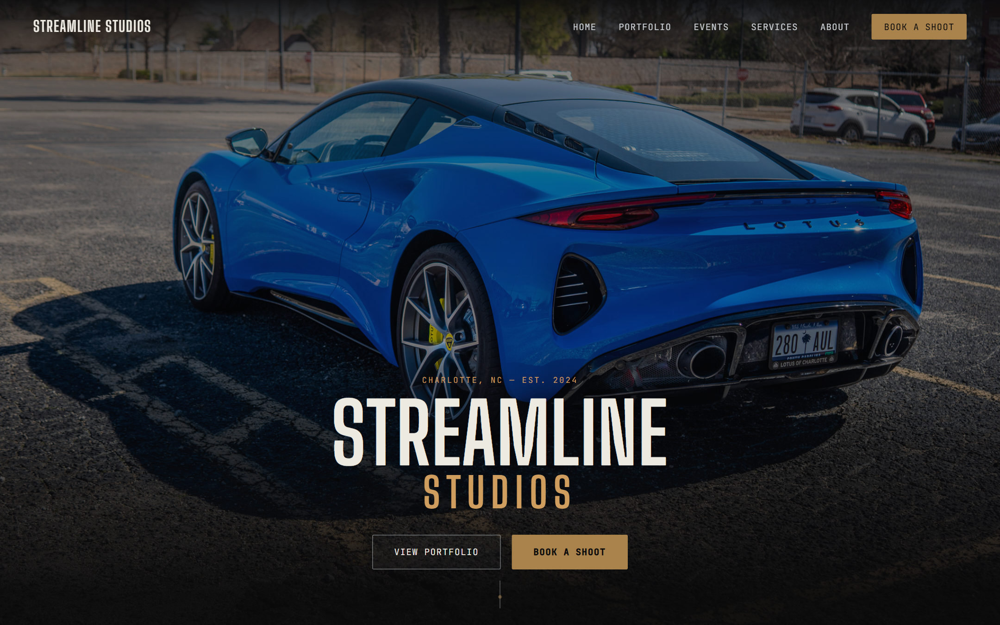
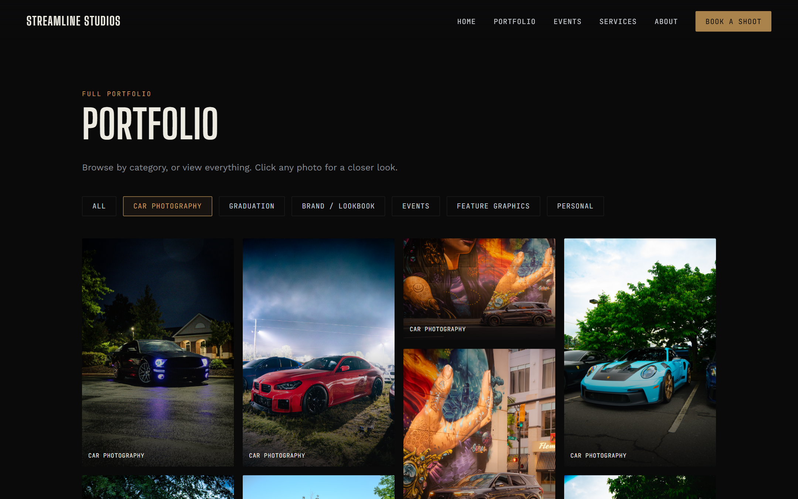
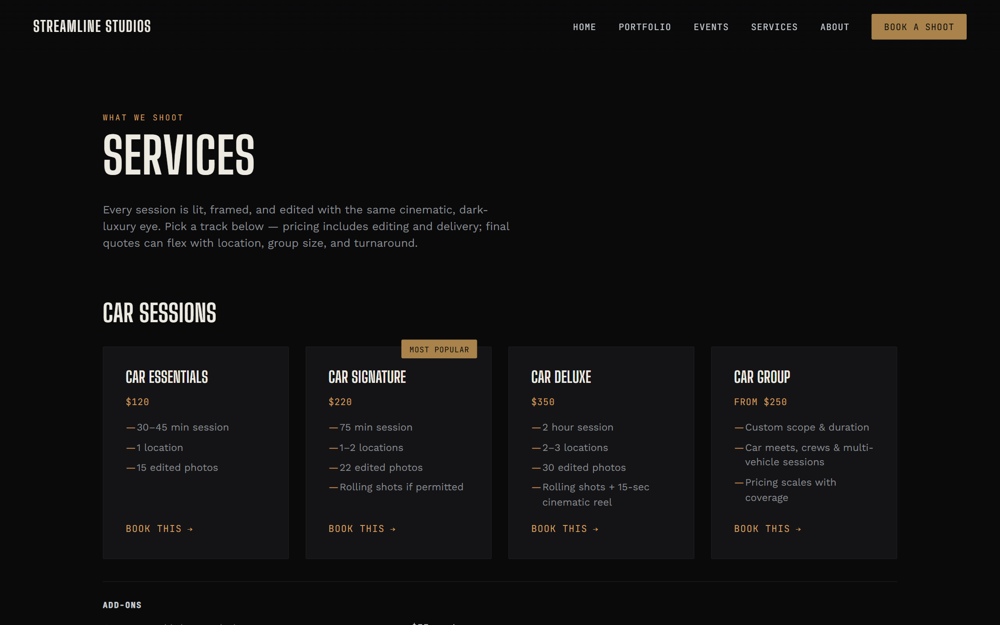

# Streamline Studios

Streamline Studios is a real automotive and lifestyle photography business based in Charlotte, NC.
This repository is the site's production codebase — built from scratch rather than from a template
or site builder, and maintained as both a working business tool (portfolio, pricing, and booking for
actual paying clients) and a coding portfolio piece.

**Live site:** Not yet deployed — see [Running locally](#running-locally) below to preview it now.

## Screenshots

**Homepage**


**Full portfolio gallery** — true masonry layout with category filtering


**Services & pricing**


## Key Features

- **Masonry portfolio gallery** — CSS multi-column masonry (no JavaScript height calculation),
  category filtering across six categories, and a lightbox that preserves each photo's true aspect
  ratio instead of cropping to a fixed box.
- **Tiered pricing & services system** — three package families (Car, Personal, Brand & Lookbook),
  each with multiple tiers and a per-family add-ons list.
- **Booking flow with dynamic add-ons** — a single booking form whose add-ons and location-preference
  fields swap based on the selected package family, driven by a `data-family` attribute rather than a
  hardcoded list of package names.
- **Custom 404 page.**
- **Responsive design** across desktop, tablet, and mobile breakpoints, including a separate
  auto-scrolling, multi-item carousel component (built for the events page) with its own responsive
  visible-item count and infinite loop.

## Tech Stack

Plain HTML, CSS, and JavaScript — no framework, no build step, no dependencies. Version controlled
with Git; structured for free static hosting on GitHub Pages (shared header/footer partials are
fetched at runtime, so the site needs to be served over HTTP rather than opened directly as a file —
see below).

## Notable Implementation Details

- True masonry via `column-count` rather than a fixed-height CSS Grid, so tile height comes from each
  photo's real aspect ratio instead of a forced crop.
- The portfolio filter bar is fully data-driven: category buttons are read from the DOM at runtime, so
  adding or removing a category doesn't require touching the filter logic in `script.js`.
- Shared header/footer markup lives in one place (`components/`) and is injected into every page via
  `fetch()`, so nav or footer changes don't need to be copy-pasted across pages.
- No image processing pipeline — photos are served at their original resolution and format, which
  surfaced (and required fixing) real layout bugs around large intrinsic image sizes blowing out
  flex/grid containers before JavaScript could constrain them.

## Project Structure

```
index.html, about.html, portfolio.html, services.html, booking.html, events.html   content pages
404.html                                                                            custom not-found page
components/                                                                         shared header/footer partials
styles.css                                                                          all styling (design tokens at the top)
script.js                                                                           filters, lightbox, carousel, forms, includes
assets/img/                                                                         site + client photography
assets/favicons/                                                                    generated favicon set
```

## Running Locally

The shared header/footer are loaded via `fetch()`, which browsers block over the `file://` protocol —
the site needs to be served over HTTP:

```
python3 -m http.server 8000
```

Then visit `http://localhost:8000`.

## What I'd Add Next

- **Client gallery system** with photo selection and payment-gated downloads, so clients can review a
  shoot and purchase/download their selects directly (in progress).
- **Stripe checkout integration** for deposits and package payments — architecture is planned (a
  serverless function creating the Checkout Session server-side, since GitHub Pages only serves static
  files), not yet implemented.
- **Automated booking-to-calendar workflow**, so a submitted booking request lands directly on a
  calendar instead of requiring manual follow-up.
